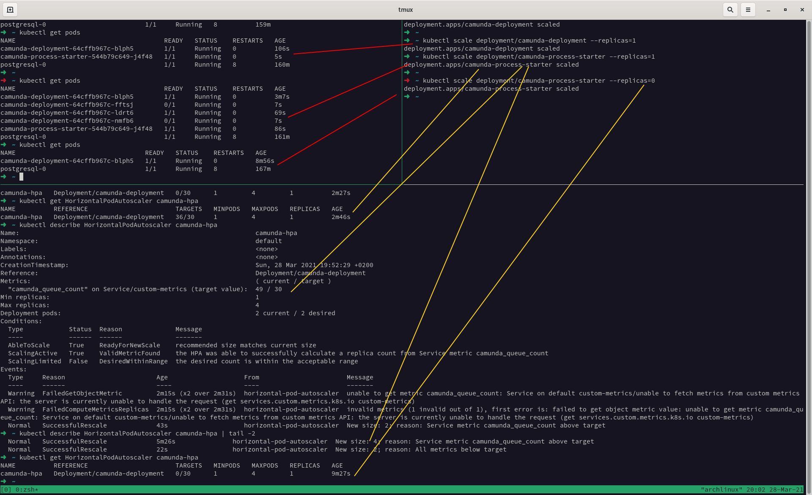

# Camunda k8s Adapter
Provides metrics to Kubernetes via custom *custom.metrics.k8s.io* api.

The adapter has a provider which query Camunda API for the number of processes started on the last 10s and return it to Kubernetes.

Based on this metric, Kubernetes HPA (Horizontal Pod Autoscaler) can be configured.

# Enable metric-server in Minikube
`minikube addons enable metrics-server`

# Deploy
Just ran the Kubernetes resources manifests:
- Adapter: `kubectl apply -f camunda-k8s-adapter.yaml`
- For HorizontalPodAutoscaler: `kubectl apply -f camunda-k8s-adapter.yaml`

# Notes
- The resources will be deployed in custom-metrics namespace.
- The Camunda API should be available on this URL:
http://camunda-service.default.svc.cluster.local:8080/engine-rest/
- The ScaleUp and ScaleDown policies are defined on the Deployment configuration. By default it takes 300s to scale down.

# How to test

- Describe the HorizontalPodAutoscaler resource:
```
➜  ~ kubectl -n default describe HorizontalPodAutoscaler
Name:                                                              camunda-hpa
Namespace:                                                         default
Labels:                                                            <none>
Annotations:                                                       <none>
CreationTimestamp:                                                 Sun, 28 Mar 2021 18:35:04 +0200
Reference:                                                         Deployment/camunda-deployment
Metrics:                                                           ( current / target )
  "camunda_queue_count" on Service/custom-metrics (target value):  22 / 30
Min replicas:                                                      1
Max replicas:                                                      4
Deployment pods:                                                   4 current / 4 desired
Conditions:
  Type            Status  Reason               Message
  ----            ------  ------               -------
  AbleToScale     True    ScaleDownStabilized  recent recommendations were higher than current one, applying the highest recent recommendation
  ScalingActive   True    ValidMetricFound     the HPA was able to successfully calculate a replica count from Service metric camunda_queue_count
  ScalingLimited  False   DesiredWithinRange   the desired count is within the acceptable range
Events:
  Type     Reason             Age                  From                       Message
  ----     ------             ----                 ----                       -------
  Warning  FailedGetScale     7m8s (x9 over 9m8s)  horizontal-pod-autoscaler  no matches for kind "Deployment" in group "extensions"
  Normal   SuccessfulRescale  6m22s                horizontal-pod-autoscaler  New size: 2; reason: Service metric camunda_queue_count above target
  Normal   SuccessfulRescale  5m21s                horizontal-pod-autoscaler  New size: 4; reason: Service metric camunda_queue_count above target
```
- Check *custom.metrics.k8s.io/v1beta1* API to verify the metrics are available:
```
➜  ~ kubectl get --raw="/apis/custom.metrics.k8s.io/v1beta1/namespaces/kube-system/services/custom-metrics/camunda_queue_count" | jq
{
  "kind": "MetricValueList",
  "apiVersion": "custom.metrics.k8s.io/v1beta1",
  "metadata": {
    "selfLink": "/apis/custom.metrics.k8s.io/v1beta1/namespaces/kube-system/services/custom-metrics/camunda_queue_count"
  },
  "items": [
    {
      "describedObject": {
        "kind": "Service",
        "namespace": "kube-system",
        "name": "custom-metrics",
        "apiVersion": "/v1"
      },
      "metricName": "",
      "timestamp": "2021-03-28T16:15:00Z",
      "value": "50",
      "selector": null
    }
  ]
}
```